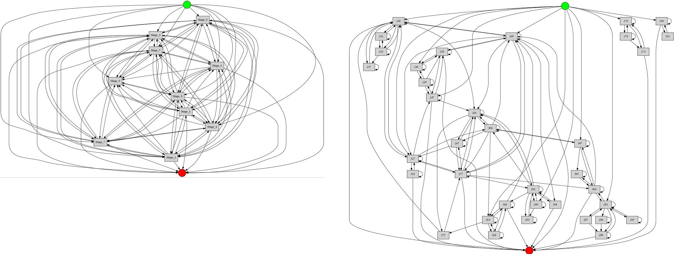
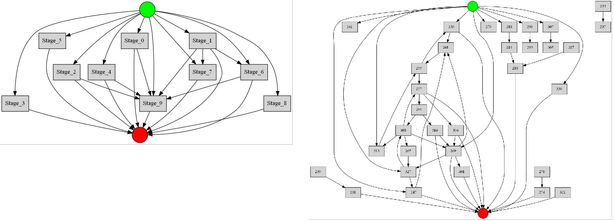
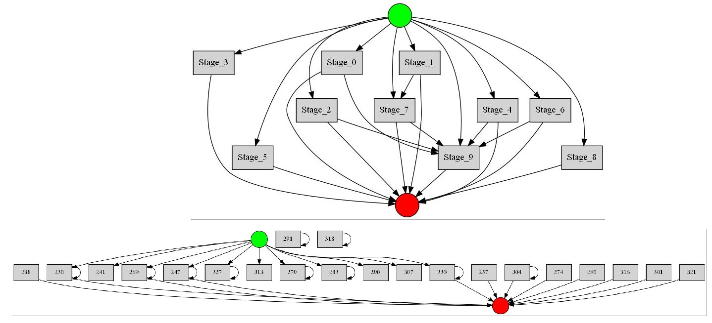
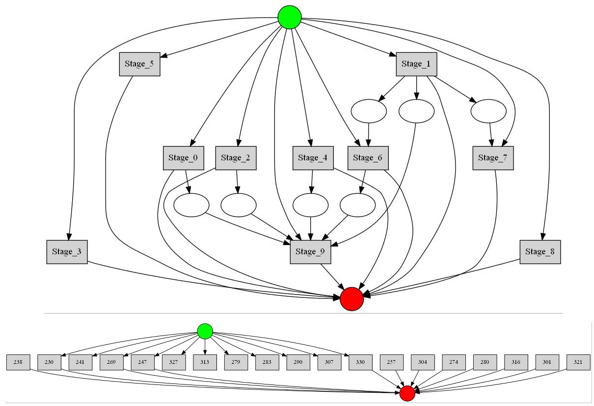
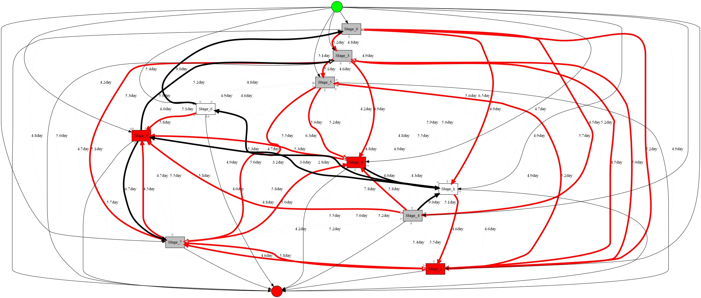
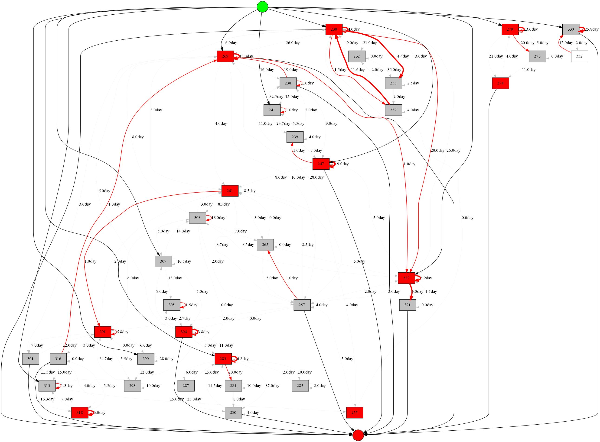
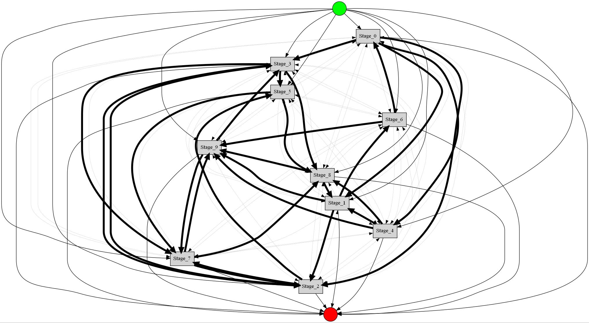
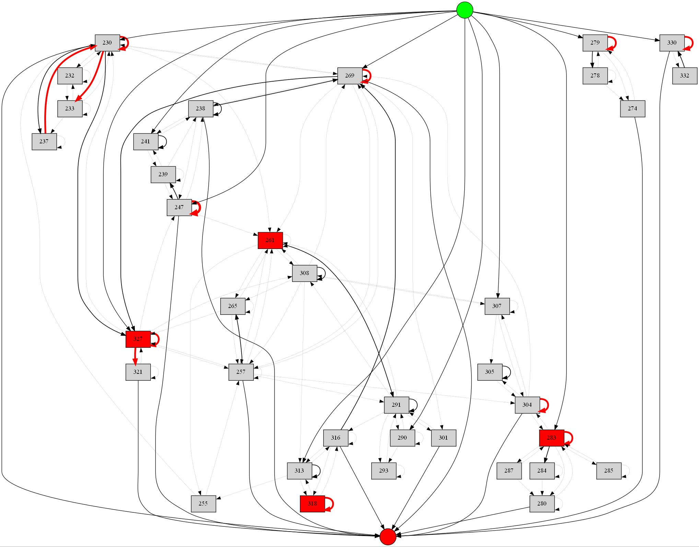
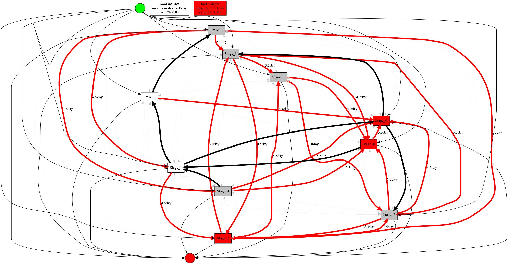
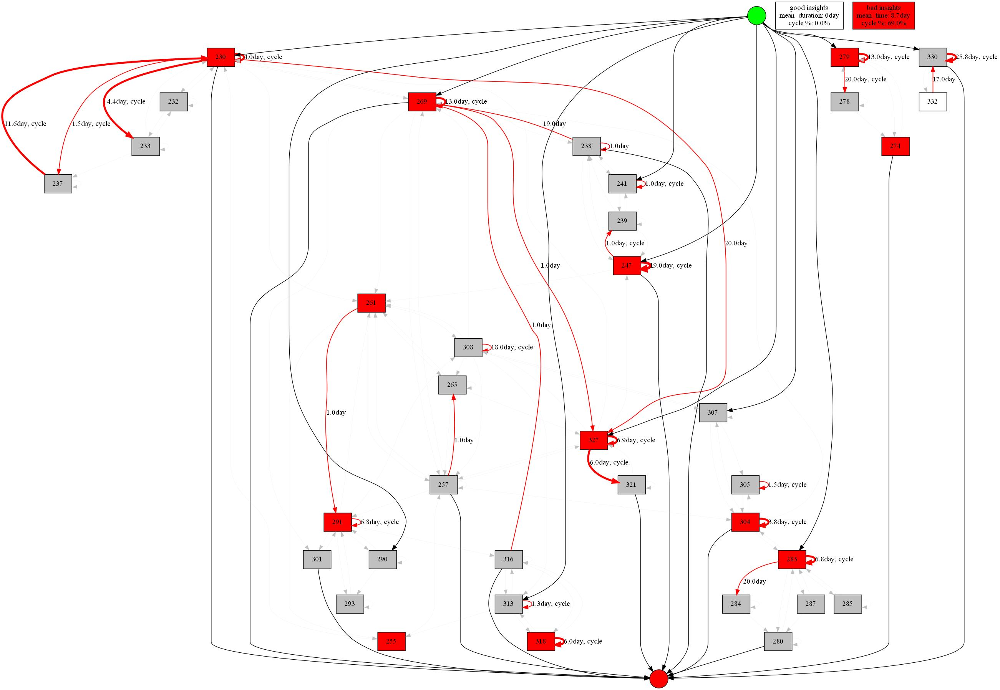

# Управление параметрами в Process mining при помощи фреймоврка Hydra


Рабочий пример использования библиотеки SberPM для Process mining'а вместе с фреймворком Hydra, для удобного логирования запусков и управления параметрами датасета и модели.

Версии библиотек, нужных для запуска программы, перечисленны в файле req.txt

## Запуск

* Для запуска с параметрами установленными в *config.yaml*: `python main.py`
* Запуск датасета по умолчанию, модели **casual**: `python main.py model=casual`
* Множественный запуск датасета **complains**, модели **insight** во всех трёх режимах: `python main.py dataset=complains model=insight mode=time,cycles,overall -m`
* Запуск всех комбинаций датасетов **example**, **complains** и моделей **simple**, **casual**, **heu**, **insight**: `python main.py dataset=complains model=simple,casual,heu,insight -m`

## Встроенные датасеты (журналы событий)

**example.csv** - демонстрационная выборка из библиотеки [Sber_Process_Mining](https://github.com/SberProcessMining/Sber_Process_Mining). 
Конфигурация для него содержится в файле *cond/dataset/example.yaml*:
```
name: example
filename: example.csv
separator: ','
id_col: id
act_col: stages
time_col: dt
date_format: '%Y-%m-%d'
```

**BPI2016_Complaints.csv** - выборка из соревнования BPI Challenge 2016 [Complaints](https://data.4tu.nl/articles/dataset/BPI_Challenge_2016_Complaints/12717647/1). 
Конфигурация для него *cond/dataset/complains.yaml*:
```
name: complains
filename: BPI2016_Complaints.csv
separator: ';'
id_col: Office_U
act_col: Office_W
time_col: ContactDate
date_format: '%Y-%m-%d'
```

## Результаты работы Моделей PM
Результаты для **example.csv** и **BPI2016_Complaints.csv** соответственно.
### 1. SimpleMiner
SimpleMiner отображает все рёбра, найденные в журнале событий (фильтрация не применяется)


### 2. CausalMiner


### 3. HeuMiner
При threshold = 0.8


### 4. AlphaMiner


### 5. Autoinsights
Модуль автоматического поиска инсайтов. С его помощью можно проанализировать лог-файл, выявить возможные узкие места процесса и визуализировать их на графе. 
Поддерживается 3 режима работы: анализ по зацикленности (Cycles), по времени выполнения (Time) и комбинированный анализ (Overall), где каждой активности и каждому переходу присваивается индекс оптимальности, показывающий, насколько тот или иной объект требует вмешательства.

#### 4.1. Time mode 
|   |   |
|---|---|
#### 4.2. Cycles mode
|   |   |
|---|---|
#### 4.3. Overall mode
|   |   |
|---|---|